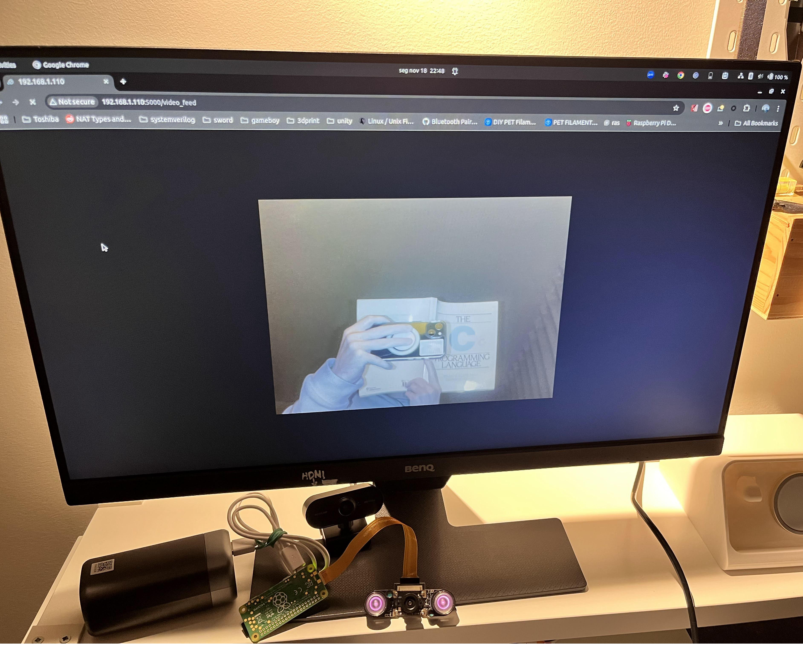

# Raspberry Pi Camera with IR Lights

This project utilizes a Raspberry Pi with an OV5647 camera module and infrared (IR) lights for enhanced vision in low-light conditions. The project integrates camera control and image processing functionalities using Python libraries.

## Features
- Capture high-quality images and videos using the OV5647 camera module.
- Enable low-light and night vision with IR lights.
- Perform image processing tasks with OpenCV.

## Requirements
To set up and run this project, ensure the following prerequisites are met:
- A Raspberry Pi (compatible model with a camera port).
- An OV5647 camera module.
- IR lights (if applicable).
- Python 3 installed on your Raspberry Pi.

Install the required software packages with the following commands:

```bash
sudo apt update
sudo apt install -y python3-picamera2
sudo apt install -y python3-opencv
pip install -r requirements.txt
```


If you are running a recent version of Raspberry pi OS (as you should to use picamera2) you do not need to enable the camera in Interfaces `raspi-config`

However, if you are running into trouble, either because you do not have a recent OS, the same camera etc etc then try enabling the camera interface in the Raspberry Pi configuration settings:
```bash
sudo raspi-config
```
Navigate to *Interface Options* -> *Camera* -> *Enable*.

## Usage
1. Clone this repository to your Raspberry Pi:
   ```bash
   git clone https://github.com/pfxr/rpi_ov5647_noir_stream.git
   cd your-repo-name
   ```

2. Connect the OV5647 camera module and IR lights. Then insert the CSI-2 ribbon cable in your Raspberry Pi.

3. Run the main script to capture images or process video streams:
   ```bash
   python3 main.py
   ```

4. Visit your raspberry pi IP address in port 5000 under /video_feed (E.g. `192.168.1.5:5000/video_feed`) in your browser


## Files and Directories
- `main.py`: The main script to control the camera and process images.
- `requirements.txt`: Lists additional Python dependencies for the project.
- `README.md`: Documentation for the project setup and usage.

## Contributing
Contributions are welcome! Feel free to open issues or submit pull requests to improve this project.

## License
This project is licensed under the MIT License. See the `LICENSE` file for details.

---

Happy coding! 🎥
```
